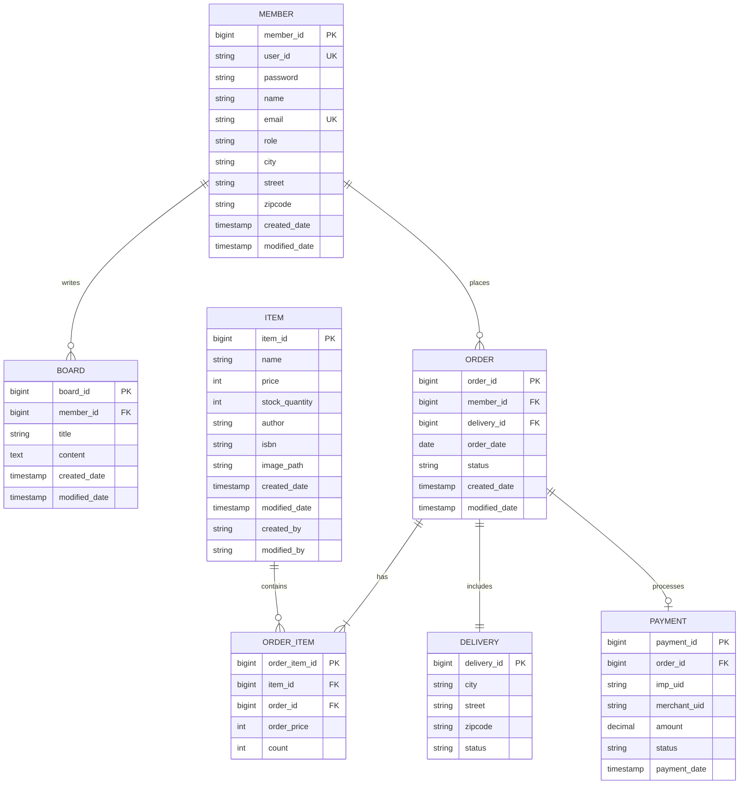

# E-Commerce Platform

> A full-stack e-commerce platform built with Spring Boot and Thymeleaf

[한국어](README.md) | **English**

---

## 📋 Table of Contents
- [Project Overview](#project-overview)
- [Tech Stack](#tech-stack)
- [Key Features](#key-features)
- [Architecture](#architecture)
- [Database Design](#database-design)
- [API Documentation](#api-documentation)

---

## 🎯 Project Overview

This project is a modern e-commerce platform that demonstrates full-stack development capabilities with Spring Boot backend and responsive frontend.

### Purpose
- Demonstrates enterprise-level architecture and best practices
- Showcases full development lifecycle from design to deployment

---

## 🛠 Tech Stack

### Backend
- **Framework**: Spring Boot 3.5.6
- **Language**: Java 21
- **Security**: Spring Security + JWT
- **Database**: MySQL 8.0
- **Cache**: Redis
- **ORM**: JPA + QueryDSL
- **API Documentation**: Swagger/OpenAPI

### Frontend
- **Template Engine**: Thymeleaf
- **Styling**: Bootstrap 5
- **JavaScript**: Vanilla JS (ES6+)

### Infrastructure
- **Cloud**: AWS (EC2, RDS, ElastiCache)
- **CI/CD**: GitHub Actions
- **Container**: Docker

---

## ✨ Key Features

### User Management
- ✅ User registration and authentication
- ✅ JWT-based session management
- ✅ Role-based access control (USER/ADMIN)
- ✅ User profile management

### Product Management
- ✅ Product CRUD operations
- ✅ Image upload functionality
- ✅ Inventory management
- ✅ Product search and filtering

### Order System
- ✅ Order placement and tracking
- ✅ Payment integration (PG integration)
- ✅ Order history

### Board System
- ✅ Post creation and editing
- ✅ Search functionality
- ✅ Pagination
- ✅ Author-only edit/delete

### Performance Optimization
- ✅ Redis caching for frequently accessed data
- ✅ Pessimistic locking for inventory management
- ✅ Query optimization with QueryDSL
- ✅ N+1 query prevention

---

## 🏗 Architecture

```
┌─────────────┐
│   Client    │
│  (Browser)  │
└──────┬──────┘
       │
       ▼
┌─────────────────────┐
│   Spring Boot App   │
│  ┌───────────────┐  │
│  │  Controllers  │  │
│  └───────┬───────┘  │
│          │          │
│  ┌───────▼───────┐  │
│  │   Services    │  │
│  └───────┬───────┘  │
│          │          │
│  ┌───────▼───────┐  │
│  │ Repositories  │  │
│  └───────┬───────┘  │
└──────────┼──────────┘
           │
     ┌─────┴─────┐
     ▼           ▼
┌─────────┐ ┌─────────┐
│  MySQL  │ │  Redis  │
└─────────┘ └─────────┘
```

---

## 🗄 Database Design

### ERD (Entity Relationship Diagram)



### Main Tables

#### Member
- User authentication and profile information
- Embedded address information

#### Item
- Product information
- Stock management
- Image storage

#### Order
- Order header information
- Links to member and delivery

#### OrderItem
- Order line items
- Product and quantity information

#### Payment
- Payment transaction records
- Integration with PG (Payment Gateway)

---

## 📚 API Documentation

API documentation is available via Swagger UI:

```
http://localhost:8080/swagger-ui.html
```

### Main Endpoints

#### Members
- `GET /api/v1/members` - Get member list
- `PUT /api/v1/members` - Update member information
- `POST /api/v1/members` - Register a new member
- `GET /api/v1/members.me` - Get member details by ID

#### Authentication
- `POST /auth/login` - Login

#### Board
- `GET /api/v1/form` - Get a post
- `PUT /api/v1/form` - Update a post
- `POST /api/v1/form` - Create a post
- `DELETE /api/v1/form` - Delete a post
- `GET /api/v1/list` - Get post list

#### Products
- `GET /item/v1/{id}/detail` - Get product details
- `PUT /item/v1/{id}/edit` - Update product
- `GET /item/v1/list` - Get product list
- `POST /item/v1/new` - Register a new product

#### Orders
- `POST /order/v1/{id}/orders` - Cancel an order
- `GET /order/v1/list` - Get order list
- `POST /order/v1/new` - Create a new order

#### Payments
- `POST /payments/v1/save` - Register a payment


---

## 🔒 Security Considerations

- JWT tokens with expiration
- Password encryption with SHA-512
- SQL injection prevention with PreparedStatement
- XSS prevention with input validation
- CORS configuration
- HTTPS enforced in production

---

## 📈 Performance Optimization

- Redis caching for product details
- Database indexing on frequently queried columns
- Connection pooling (HikariCP)
- Lazy loading for JPA entities
- Query optimization with QueryDSL

---

## 👤 Author

**Manjae Kim**
- GitHub: [kimmanjae](https://github.com/ei1111)
- LinkedIn: [kimmanjae](https://www.linkedin.com/in/manjae-kim-ba4a3a235/)
- Email: ei1111@naver.com

---