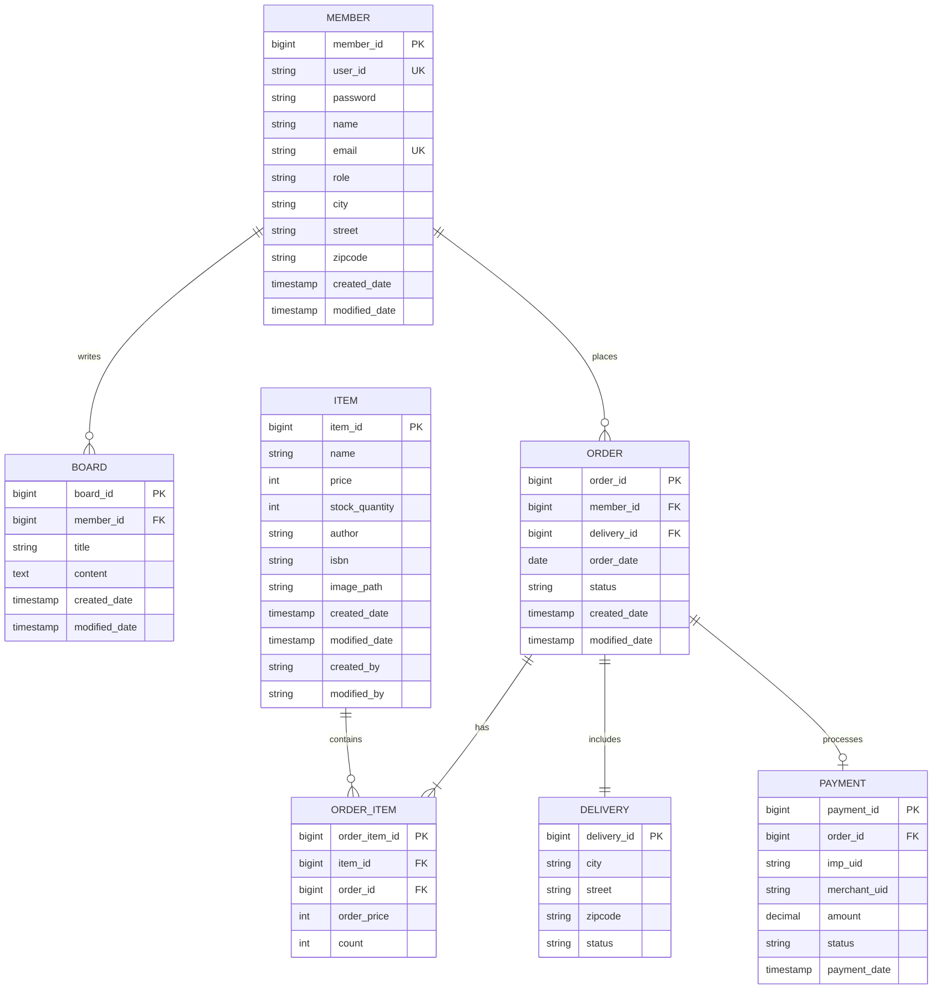

# E-Commerce 플랫폼

> Spring Boot와 Thymeleaf로 구축한 풀스택 쇼핑몰 플랫폼

**한국어** | [English](README.en.md)

---

## 📋 목차
- [프로젝트 개요](#프로젝트-개요)
- [기술 스택](#기술-스택)
- [주요 기능](#주요-기능)
- [아키텍처](#아키텍처)
- [데이터베이스 설계](#데이터베이스-설계)
- [API 문서](#api-문서)

---

## 🎯 프로젝트 개요

이 프로젝트는 Spring Boot 백엔드와 반응형 프론트엔드를 갖춘 현대적인 전자상거래 플랫폼입니다.

### 목적
- 엔터프라이즈급 아키텍처와 모범 사례 구현
- 설계부터 배포까지 전체 개발 생명주기 시연

---

## 🛠 기술 스택

### Backend
- **Framework**: Spring Boot 3.5.6
- **Language**: Java 21
- **Security**: Spring Security + JWT
- **Database**: MySQL 8.0
- **Cache**: Redis
- **ORM**: JPA + QueryDSL
- **API Documentation**: Swagger/OpenAPI

### Frontend
- **Template Engine**: Thymeleaf
- **Styling**: Bootstrap 5
- **JavaScript**: Vanilla JS (ES6+)

### Infrastructure
- **Cloud**: AWS (EC2, RDS, ElastiCache)
- **Container**: Docker

---

## ✨ 주요 기능

### 회원 관리
- ✅ 회원 가입 및 인증
- ✅ JWT 기반 세션 관리
- ✅ 역할 기반 접근 제어 (USER/ADMIN)
- ✅ 회원 프로필 관리

### 상품 관리
- ✅ 상품 CRUD 기능
- ✅ 이미지 업로드 기능
- ✅ 재고 관리
- ✅ 상품 검색 및 필터링

### 주문 시스템
- ✅ 주문 생성 및 추적
- ✅ 결제 연동 (PG 연동)
- ✅ 주문 내역 조회

### 게시판 시스템
- ✅ 게시글 작성 및 수정
- ✅ 검색 기능
- ✅ 페이지네이션
- ✅ 작성자만 수정/삭제 가능

### 성능 최적화
- ✅ 자주 조회되는 데이터의 Redis 캐싱
- ✅ 재고 관리를 위한 비관적 락
- ✅ QueryDSL을 이용한 쿼리 최적화
- ✅ N+1 쿼리 방지

---

## 🏗 아키텍처

```
┌─────────────┐
│   Client    │
│  (Browser)  │
└──────┬──────┘
       │
       ▼
┌─────────────────────┐
│   Spring Boot App   │
│  ┌───────────────┐  │
│  │  Controllers  │  │
│  └───────┬───────┘  │
│          │          │
│  ┌───────▼───────┐  │
│  │   Services    │  │
│  └───────┬───────┘  │
│          │          │
│  ┌───────▼───────┐  │
│  │ Repositories  │  │
│  └───────┬───────┘  │
└──────────┼──────────┘
           │
     ┌─────┴─────┐
     ▼           ▼
┌─────────┐ ┌─────────┐
│  MySQL  │ │  Redis  │
└─────────┘ └─────────┘
```

---

## 🗄 데이터베이스 설계

### ERD (Entity Relationship Diagram)



### 주요 테이블

#### Member (회원)
- 사용자 인증 및 프로필 정보
- 주소 정보 내장

#### Item (상품)
- 상품 정보
- 재고 관리
- 이미지 저장

#### Order (주문)
- 주문 헤더 정보
- 회원 및 배송 연결

#### OrderItem (주문상품)
- 주문 라인 아이템
- 상품 및 수량 정보

#### Payment (결제)
- 결제 거래 기록
- PG사 연동

---


## 📚 API 문서

Swagger UI를 통해 API 문서를 확인할 수 있습니다:

```
http://localhost:8080/swagger-ui.html
```

### 주요 엔드포인트

#### 회원
- `GET /api/v1/members` - 회원 리스트
- `PUT /api/v1/members` - 회원 정보 수정
- `POST /api/v1/members` - 회원 정보 등록
- `GET /api/v1/members.me` - 회원 아이디로 상세 조회

#### 인증
- `POST /auth/login` - 로그인

#### 게시판
- `GET /api/v1/form` - 게시글 글 조회
- `PUT /api/v1/form` - 게시글 글 수
- `POST /api/v1/form` - 게시글 작성
- `DELETE /api/v1/form` - 게시글 삭제
- `GET /api/v1/list` - 게시글 리스트 조회

#### 상품
- `GET /item/v1/{id}/detail` - 상품 상세 조회 
- `PUT /item/v1/{id}/edit` - 상품 수정 
- `GET /item/v1/list` - 상품 리스트
- `POST /item/v1/new` - 상품 정보 등록

#### 주문
- `POST /order/v1/{id}/orders` - 주문 취소
- `GET /order/v1/list` - 주문 목록 조회
- `POST /order/v1/new` - 주문 정보 등록

#### 결제
- `POST /payments/v1/save` - 결제 등록
---

## 🔒 보안 고려사항

- 만료 기능이 있는 JWT 토큰
- SHA-512를 사용한 비밀번호 암호화
- PreparedStatement를 통한 SQL 인젝션 방지
- 입력 검증을 통한 XSS 방지
- CORS 설정
- 프로덕션 환경에서 HTTPS 강제

---

## 📈 성능 최적화

- 상품 상세 정보의 Redis 캐싱
- 자주 조회되는 컬럼에 대한 데이터베이스 인덱싱
- 커넥션 풀링 (HikariCP)
- JPA 엔티티의 지연 로딩
- QueryDSL을 통한 쿼리 최적화

---

## 👤 작성자

**Your Name**
- GitHub: [김만재](https://github.com/ei1111)
- LinkedIn: [김만재](https://www.linkedin.com/in/manjae-kim-ba4a3a235/)
- Email: ei1111@naver.com

---